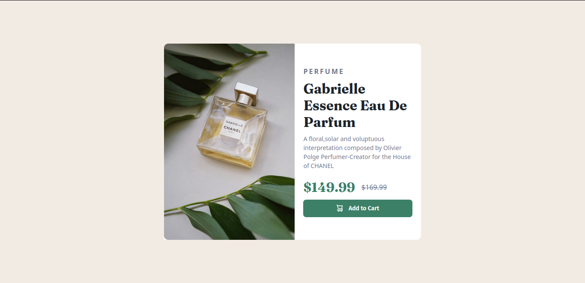

# Frontend Mentor - Product preview card component solution

This is a solution to the [Product preview card component challenge on Frontend Mentor](https://www.frontendmentor.io/challenges/product-preview-card-component-GO7UmttRfa).  

## Table of contents

- [Overview](#overview)
  - [The challenge](#the-challenge)
  - [Screenshot](#screenshot)
  - [Links](#links)
- [My process](#my-process)
  - [Built with](#built-with)
  - [What I learned](#what-i-learned)
  - [Continued development](#continued-development)
  - [Useful resources](#useful-resources)
- [Author](#author)
- [Acknowledgments](#acknowledgments)

## Overview

### The challenge

Users should be able to:

- View the optimal layout depending on their device's screen size
- See hover and focus states for interactive elements

### Screenshot

### Links

- Solution URL: [Solution](https://github.com/Raymacmillan/Project-preview-card-component)
- Live Site URL: [Live Site](https://raymacmillan.github.io/Project-preview-card-component/)

## My process

### Built with

- HTML5
- Flexbox
- Mobile-first workflow

### What I learned

I learnt how to use @media to make responsive designs.Also learnt how to use Google fonts in CSS.I also learnt how to center a container in the middle of the screen

### Continued development

I want to focus mainly on using flex box more often and making more responsive designs to enhance my programming skills

### Useful resources

## Author

- Frontend Mentor - [@Ray Mcmillan Gumbo](https://www.frontendmentor.io/profile/yourusername)
- Twitter - [@RyoGenex](https://www.twitter.com/yourusername)

## Acknowledgments

I would like to thank volunteers on Stackoverflow that taught me of the different ways of using Google fonts in CSS as well as my older brother who help me with my CSS styling and taught me some useful concepts